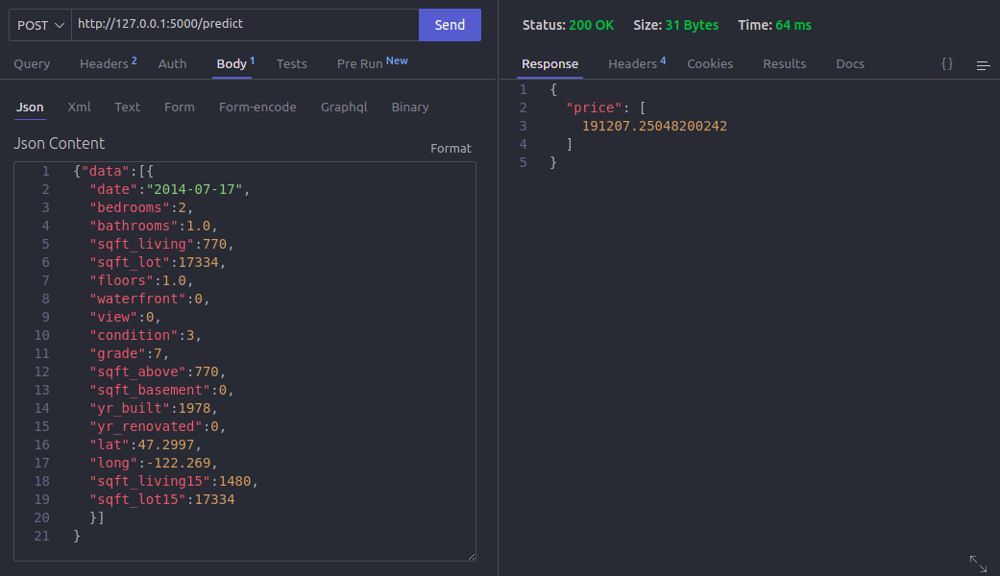

# House Pricing Regression

This is a repository of a full datascience project focused on MLOps: Deployment, unitary tests, OOP, MLFlow. The goal is to predict prices of houses based on the Kings County dataset (avaliable [here]).

 

## analysis/house_pricing.ipynp
In this file you will find a notebook with the steps to find the best model.

## train.py
In this file you will find the code to train the model, including the data preparation and hyperparameter tuning.

## app.py
In this file is the flask code for the API to predict prices, using the model loaded from MLFlow.

## How to run
First, to run the webapp locally you are going to have to clone the repository:

    gh repo clone kairosilveira/house-pricing-regression
    cd house-pricing-regression/

Then, create and activate the virtual environment and install the dependencies(make sure eu you have python3 installed):

    python -m venv venv

Activate venv on linux

    source venv/bin/activate 

Activate venv on windows

    venv/Scripts/activate 

Install dependencies

    python -m pip install --upgrade pip

    pip install -r requirements.txt

After installation is done, you can start the flask aplication running the app.py file

    python3 app.py

Now you can use the post method to make predictions using your local server adding /predict to the endpoint, here is an example using thunder:

[here]: https://www.kaggle.com/harlfoxem/housesalesprediction

{"data":[{
  "date":"2014-07-17",
  "bedrooms":2,
  "bathrooms":1.0,
  "sqft_living":770,
  "sqft_lot":17334,
  "floors":1.0,
  "waterfront":0,
  "view":0,
  "condition":3,
  "grade":7,
  "sqft_above":770,
  "sqft_basement":0,
  "yr_built":1978,
  "yr_renovated":0,
  "lat":47.2997,
  "long":-122.269,
  "sqft_living15":1480,
  "sqft_lot15":17334
  }]
}